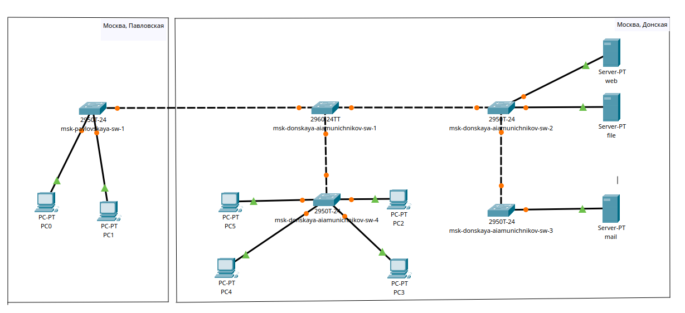
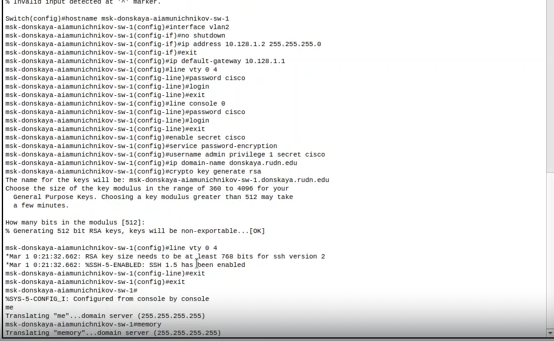
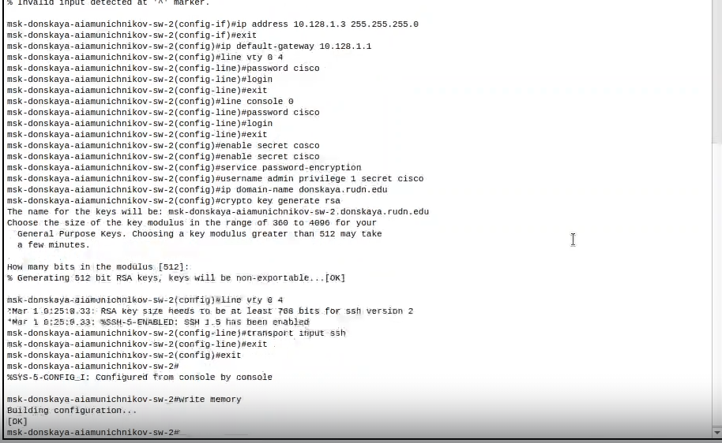
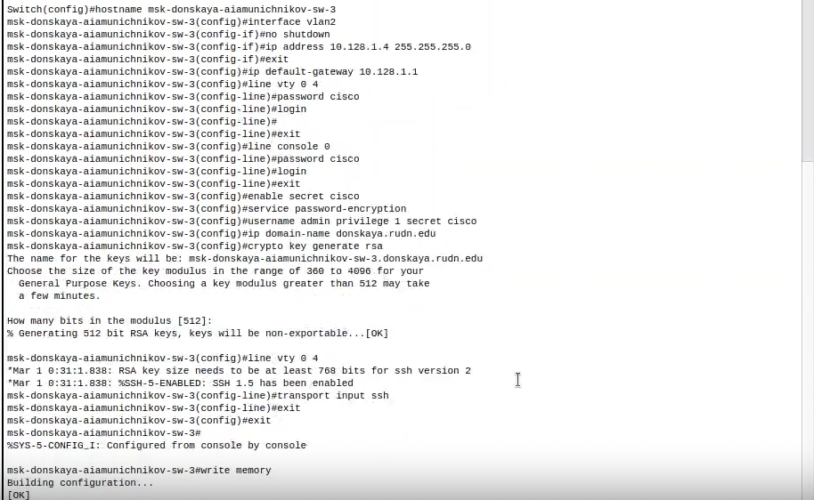
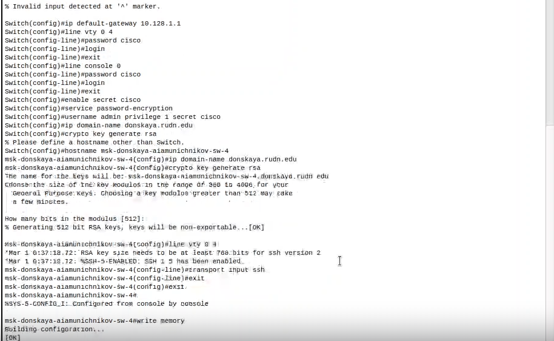
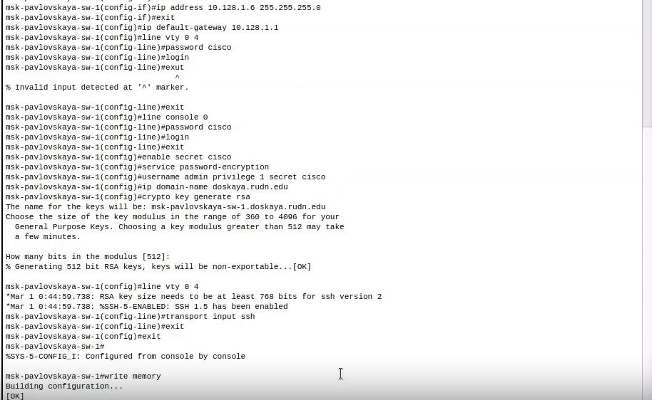

---
## Front matter
lang: ru-RU
title: Презентация по лабораторной работе №4
subtitle: ""
author:
  - Амуничников Антон
institute:
  - Российский университет дружбы народов, Москва, Россия

## i18n babel
babel-lang: russian
babel-otherlangs: english

## Formatting pdf
toc: false
toc-title: Содержание
slide_level: 2
aspectratio: 169
section-titles: true
theme: metropolis
header-includes:
 - \metroset{progressbar=frametitle,sectionpage=progressbar,numbering=fraction}
---

## Докладчик

  * Амуничников Антон Игоревич
  * 1132227133
  * уч. группа: НПИбд-01-22
  * Факультет физико-математических и естественных наук
  * Российский университет дружбы народов

## Цель работы

Провести подготовительную работу по первоначальной настройке коммутаторов сети.

# Выполнение лабораторной работы

## Повторяю тополгию из текста лабораторной работы в приложении "Packet tracer Cisco" 

{#fig:001 width=50%}

## Провожу настройку коммутаора msk-donskaya-aiamunichnikov-sw-1 

**Switch>enable:** Переход в режим привилегированного EXEC, который позволяет выполнять более сложные команды.

**Switch#**configure terminal: Переход в режим глобальной конфигурации, где можно настраивать различные параметры устройства.

**Switch (config)#**hostname msk-donskaya-sw-1: Установка имени хоста коммутатора на "msk-donskaya-sw-1".

**msk-donskaya-sw-1 (config)#**interface vlan2: Переход к настройкам интерфейса VLAN 2.

**msk-donskaya-sw-1 (config-if)#**no shutdown: Включение интерфейса VLAN 2 (по умолчанию интерфейсы могут быть отключены).

**msk-donskaya-sw-1(config-if)#**ip address 10.128.1.2 255.255.255.0: Назначение IP-адреса 10.128.1.2 с маской подсети 255.255.255.0 для интерфейса VLAN 2.

**msk-donskaya-sw-1 (config-if)#**exit: Выход из режима настройки интерфейса.

## Продолжение описания алгоритма

**msk-donskaya-sw-1 (config)#**ip default-gateway 10.128.1.1: Установка шлюза по умолчанию на 10.128.1.1, что позволяет устройству отправлять пакеты в другие сети.

**msk-donskaya-sw-1 (config)#**line vty 0 4: Переход к настройке виртуальных терминалов (VTY) для удаленного доступа (SSH или Telnet).

**msk-donskaya-sw-1 (config-line)#**password cisco: Установка пароля "cisco" для доступа к виртуальным терминалам.

**msk-donskaya-sw-1 (config-line)#**login: Включение проверки пароля при доступе к виртуальным терминалам.

**msk-donskaya-sw-1 (config-line)#**exit: Выход из режима настройки VTY.

## Продолжение описания алгоритма

**msk-donskaya-sw-1 (config)#**line console 0: Переход к настройке консольного порта.

**msk-donskaya-sw-1 (config-line)#**password cisco: Установка пароля "cisco" для консольного доступа.

**msk-donskaya-sw-1 (config-line)#**login: Включение проверки пароля для консольного доступа.

**msk-donskaya-sw-1 (config-line)#**exit: Выход из режима настройки консоли.

**msk-donskaya-sw-1 (config)#**enable secret cisco: Установка секретного пароля для доступа к привилегированному режиму EXEC, который будет зашифрован.

## Продолжение описания алгоритма

**msk-donskaya-sw-1 (config)#**service password-encryption: Включение шифрования паролей в конфигурации, чтобы они не отображались в открытом виде.

**msk-donskaya-sw-1 (config)#**username admin privilege 1 secret cisco: Создание пользователя "admin" с уровнем привилегий 1 и секретным паролем "cisco".

**msk-donskaya-sw-1 (config)#**ip domain-name donskaya.run.edu: Установка доменного имени для устройства.

**msk-donskaya-sw-1 (config)#**crypto key generate rsa: Генерация RSA ключей для шифрования, необходимая для настройки SSH.

**msk-donskaya-sw-1 (config)#**line vty 0 4: Снова переходим к настройке виртуальных терминалов для SSH.

## Продолжение описания алгоритма

**msk-donskaya-sw-1(config-line)#**transport input ssh: Ограничение доступа к виртуальным терминалам только через SSH.

**msk-donskaya-sw-1 (config-line)#**exit: Выход из режима настройки VTY.

**msk-donskaya-sw-1 (config)#**exit: Выход из глобального режима конфигурации.

**msk-donskaya-sw-1#**write memory: Сохранение текущей конфигурации в память, чтобы изменения не потерялись после перезагрузки устройства.

## Работа в терминале

{#fig:002 width=50%}

## Провожу настройку коммутаора msk-donskaya-aiamunichnikov-sw-2

{#fig:003 width=50%}

## Провожу настройку коммутатора msk-donskaya-aiamunichnikov-sw-3

{#fig:004 width=50%}

## Провожу настройку коммутатора msk-donskaya-aiamunichnikov-sw-4 

{#fig:005 width=50%}

## Провожу настройку коммутатора msk-pavlovskaya-aiamunichnikov-sw-1

{#fig:006 width=50%}

## Вывод

Провел подготовительную работу по первоначальной настроке коммутаторов сети.

