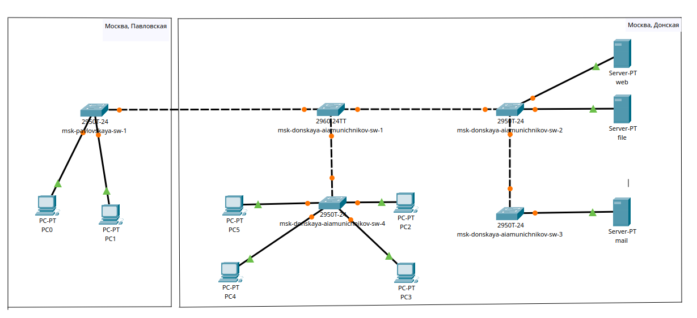
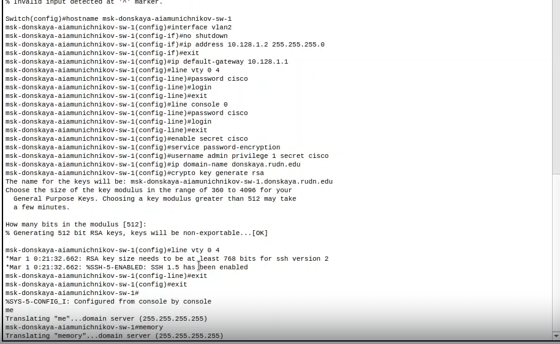
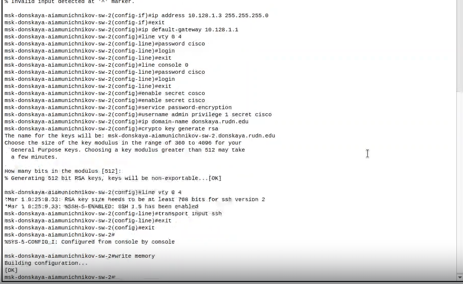
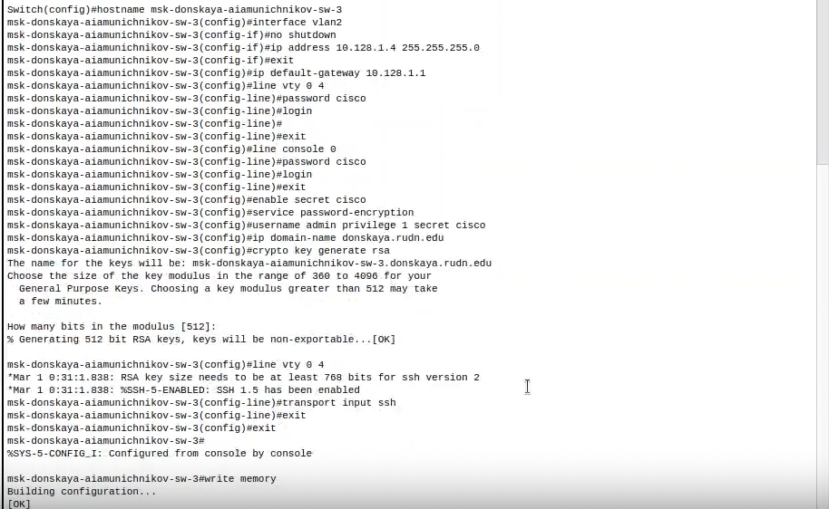
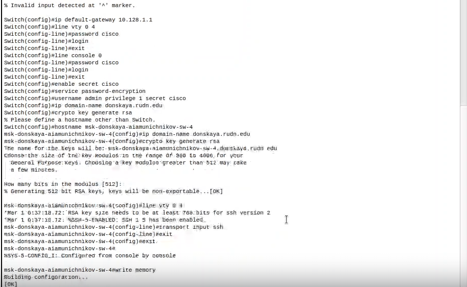
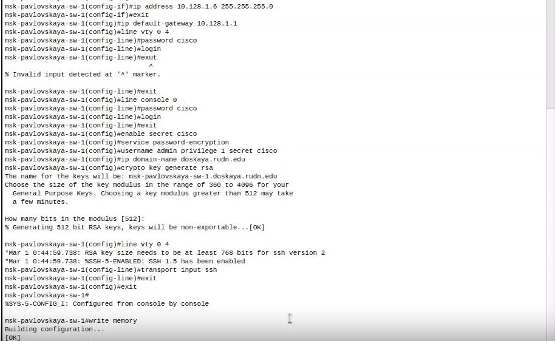

---
## Front matter
title: "Отчет по лабораторной работе № "
subtitle: "Администрирование локальных сетей"
author: "Амуничников Антон, НПИбд-01-22"

## Generic otions
lang: ru-RU
toc-title: "Содержание"

## Bibliography
bibliography: bib/cite.bib
csl: pandoc/csl/gost-r-7-0-5-2008-numeric.csl

## Pdf output format
toc: true # Table of contents
toc-depth: 2
lof: true # List of figures
lot: false # List of tables
fontsize: 12pt
linestretch: 1.5
papersize: a4
documentclass: scrreprt
## I18n polyglossia
polyglossia-lang:
  name: russian
  options:
	- spelling=modern
	- babelshorthands=true
polyglossia-otherlangs:
  name: english
## I18n babel
babel-lang: russian
babel-otherlangs: english
## Fonts
mainfont: IBM Plex Serif
romanfont: IBM Plex Serif
sansfont: IBM Plex Sans
monofont: IBM Plex Mono
mathfont: STIX Two Math
mainfontoptions: Ligatures=Common,Ligatures=TeX,Scale=0.94
romanfontoptions: Ligatures=Common,Ligatures=TeX,Scale=0.94
sansfontoptions: Ligatures=Common,Ligatures=TeX,Scale=MatchLowercase,Scale=0.94
monofontoptions: Scale=MatchLowercase,Scale=0.94,FakeStretch=0.9
mathfontoptions:
## Biblatex
biblatex: true
biblio-style: "gost-numeric"
biblatexoptions:
  - parentracker=true
  - backend=biber
  - hyperref=auto
  - language=auto
  - autolang=other*
  - citestyle=gost-numeric
## Pandoc-crossref LaTeX customization
figureTitle: "Рис."
tableTitle: "Таблица"
listingTitle: "Листинг"
lofTitle: "Список иллюстраций"
lotTitle: "Список таблиц"
lolTitle: "Листинги"
## Misc options
indent: true
header-includes:
  - \usepackage{indentfirst}
  - \usepackage{float} # keep figures where there are in the text
  - \floatplacement{figure}{H} # keep figures where there are in the text
---

# Цель работы

Провести подготовительную работу по первоначальной настройке коммутаторов сети.

# Выполнение лабораторной работы

1. Повторяю топологию сети из материала лабораторной работы в приложении "Cisco Packet tracer" (рис. [-@fig:001]).

{#fig:001 width=70%}

2. Провожу настройку коммутатора msk-donskaya-aiamunichnikov-sw-1 (рис. [-@fig:002]):

**Switch>enable:** Переход в режим привилегированного EXEC, который позволяет выполнять более сложные команды.

**Switch#**configure terminal: Переход в режим глобальной конфигурации, где можно настраивать различные параметры устройства.

**Switch (config)#**hostname msk-donskaya-sw-1

**msk-donskaya-sw-1 (config)#**interface vlan2

**msk-donskaya-sw-1 (config-if)#**no shutdown

**msk-donskaya-sw-1(config-if)#**ip address 10.128.1.2 255.255.255.0

**msk-donskaya-sw-1 (config-if)#**exit

**msk-donskaya-sw-1 (config)#**ip default-gateway 10.128.1.1

**msk-donskaya-sw-1 (config)#**line vty 0 4

**msk-donskaya-sw-1 (config-line)#**password cisco

**msk-donskaya-sw-1 (config-line)#**login

**msk-donskaya-sw-1 (config-line)#**exit

**msk-donskaya-sw-1 (config)#**line console 0

**msk-donskaya-sw-1 (config-line)#**password cisco

**msk-donskaya-sw-1 (config-line)#**login

**msk-donskaya-sw-1 (config-line)#**exit

**msk-donskaya-sw-1 (config)#**enable secret cisco

**msk-donskaya-sw-1 (config)#**service password-encryption

**msk-donskaya-sw-1 (config)#**username admin privilege 1 secret cisco

**msk-donskaya-sw-1 (config)#**ip domain-name donskaya.run.edu

**msk-donskaya-sw-1 (config)#**crypto key generate rsa

**msk-donskaya-sw-1 (config)#**line vty 0 4

**msk-donskaya-sw-1(config-line)#**transport input ssh

**msk-donskaya-sw-1 (config-line)#**exit

**msk-donskaya-sw-1 (config)#**exit

**msk-donskaya-sw-1#**write memory

{#fig:002 width=70%}

3. Провожу настройку коммутатора msk-donskaya-aiamunichnikov-sw-2 (рис. [-@fig:003]):

{#fig:003 width=70%}

4. Провожу настройку коммутатора msk-donskaya-aiamunichnikov-sw-3 (рис. [-@fig:004]):

{#fig:004 width=70%}

5. Провожу настройку коммутатора msk-donskaya-aiamunichnikov-sw-4 (рис. [-@fig:005]):

{#fig:005 width=70%}

5. Провожу настройку коммутатора msk-pavlovkaya-aiamunichnikov-sw-1 (рис. [-@fig:006]):

{#fig:006 width=70%}

# Выводы

Провел подготовительную работу по первоначальной настройке коммутаторов сети.

# Ответы на вопросы

1. Для просмотра конфигурации:

    * show running-config - показывает текущую конфигурацию.
    
    * show startup-config - показывает конфигурацию, загружаемую при старте.
    
2. Для просмотра стартового конфигурационного файла:

    * show startup-config - показывает стартовую конфигурацию
    
3. Для экспорта конфигурационного файла:

    * copy running-config tftp: - для копирование текущей конфигурации на TFTP-сервер.
    
    *copy startup-config tftp: - для копирование стартовой конфигурации на TFTP-сервер.
    
4. Для импорта конфигурационного файла:

    * copy tftp: running-config - для загрузки конфигурации с TFTP-сервера в текущую.
    
    * copy tftp: startup-config - для загрузки конфигурации с TFTP-сервера в стартовую.

