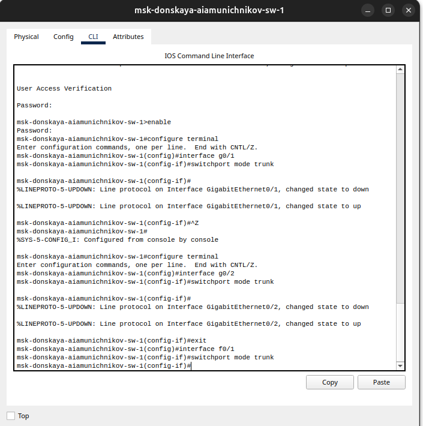
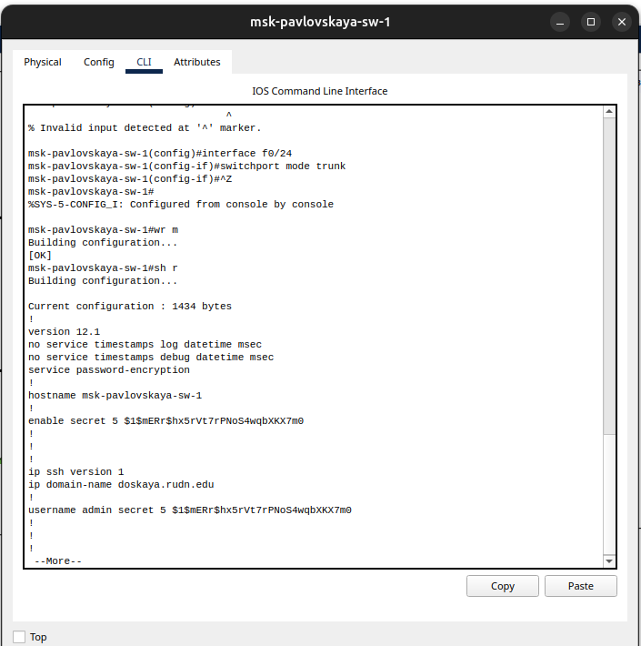
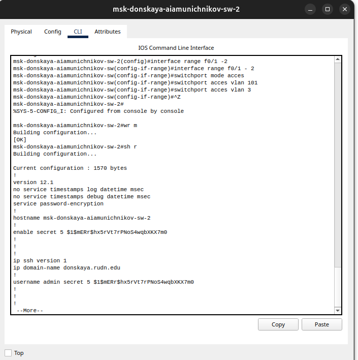
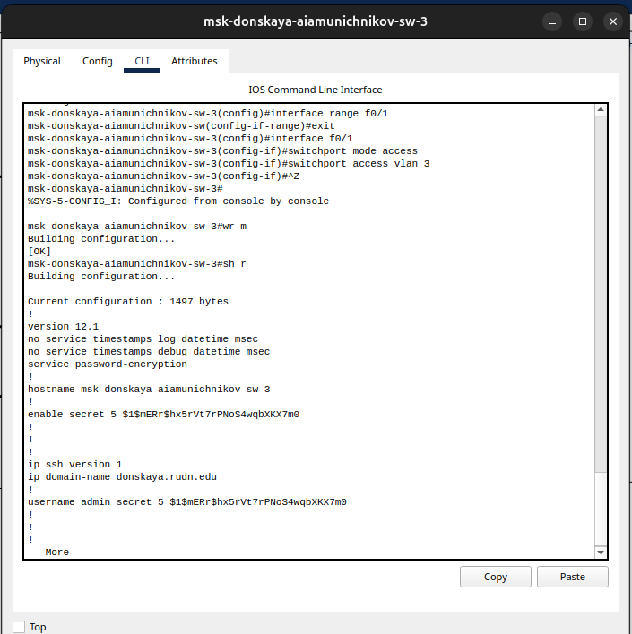
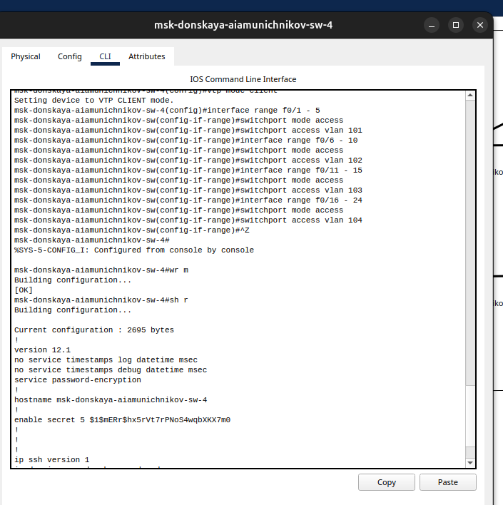
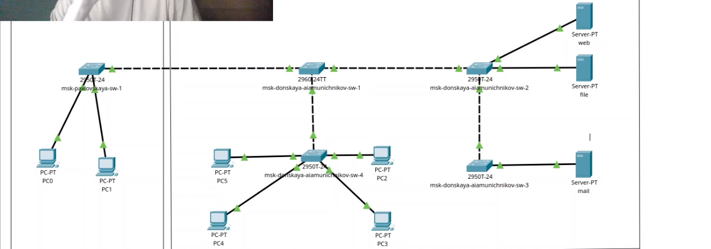
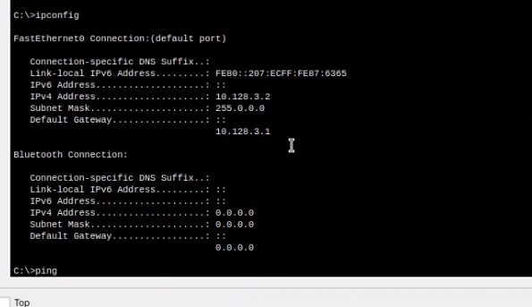
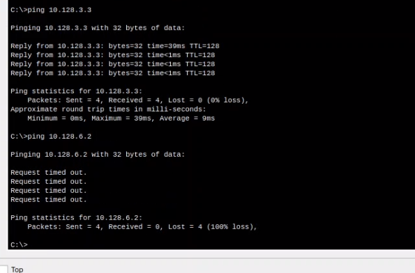
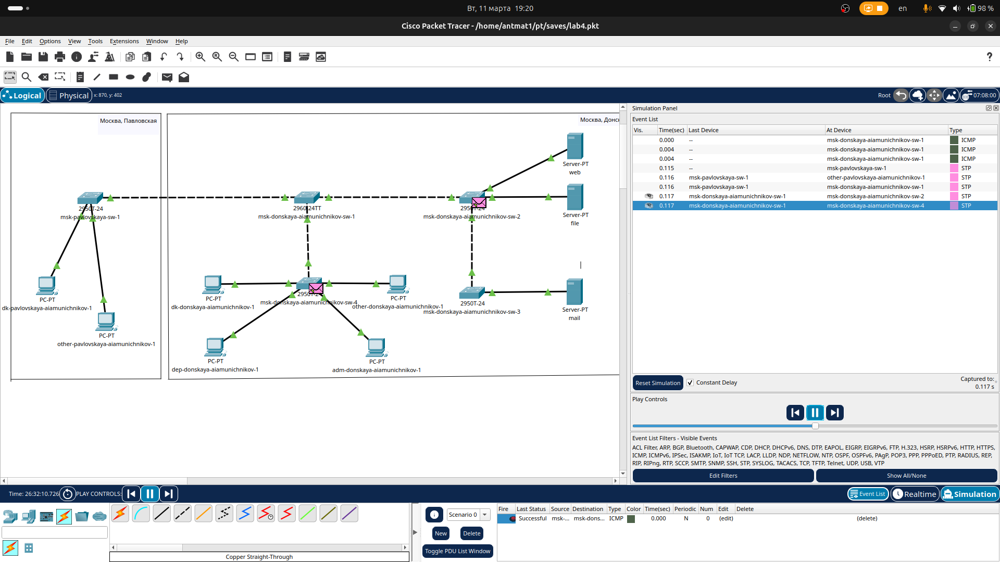
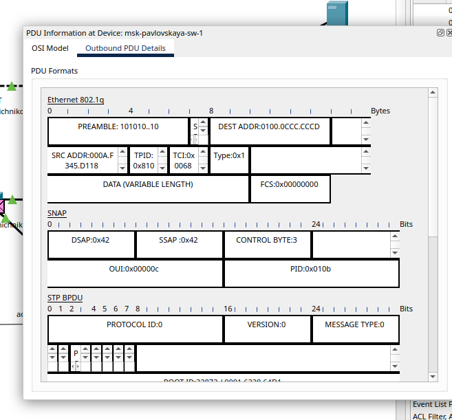

---
## Front matter
lang: ru-RU
title: Презентация по лабораторной работе №5
subtitle: ""
author:
  - Амуничников Антон
institute:
  - Российский университет дружбы народов, Москва, Россия

## i18n babel
babel-lang: russian
babel-otherlangs: english

## Formatting pdf
toc: false
toc-title: Содержание
slide_level: 2
aspectratio: 169
section-titles: true
theme: metropolis
header-includes:
 - \metroset{progressbar=frametitle,sectionpage=progressbar,numbering=fraction}
 - '\makeatletter'
 - '\beamer@ignorenonframefalse'
 - '\makeatother'
---

## Докладчик

  * Амуничников Антон Игоревич
  * 1132227133
  * уч. группа: НПИбд-01-22
  * Факультет физико-математических и естественных наук
  * Российский университет дружбы народов

## Цели и задачи

Получить основные навыки по настройке VLAN на коммутаторах сети.

## Выполнение лабораторной работы

## Используя последовательность из текста лабороторной работы проводим конфигурацию Trunk-порта на коммутаторе msk-donskaya-aiamunichnikov-sw-1

{#fig:001 width=60%}

## Используя последовательность из текста лабороторной работы проводим конфигурацию Trunk-порта на коммутаторе msk-pavlovskaya-aiamunichnikov-sw-1

{#fig:002 width=60%}

## Прописываем конфигурацию диапозонов портов и конфигурации VTP msk-donskaya-aiamunichnikov-sw-01 

{#fig:003 width=70%}

## Прописываем конфигурацию диапозонов портов и конфигурации VTP msk-donskaya-aiamunichnikov-sw-02 

{#fig:004 width=70%}

## Прописываем конфигурацию диапозонов портов и конфигурации VTP msk-donskaya-aiamunichnikov-sw-03 

{#fig:005 width=70%}

## Прописываем конфигурацию диапозонов портов и конфигурации VTP msk-donskaya-aiamunichnikov-sw-04 

{#fig:006 width=70%}

## В построенной сети все комутаторы активны

{#fig:007 width=70%}

## Проверим результат проделанной работы на dep-donskaya-aiamunichnikov-1 и попробуем пропинговать устройство из другой сети. Неудачно 

{#fig:008 width=70%}

{#fig:009 width=70%}

## Используя режим симуляции, изучим процесс передвижения пакета ICMP по сети.

{#fig:010 width=70%}

{#fig:011 width=70%}

## Выводы

Получили основные навыки по настройке VLAN на коммутаторах сети.

