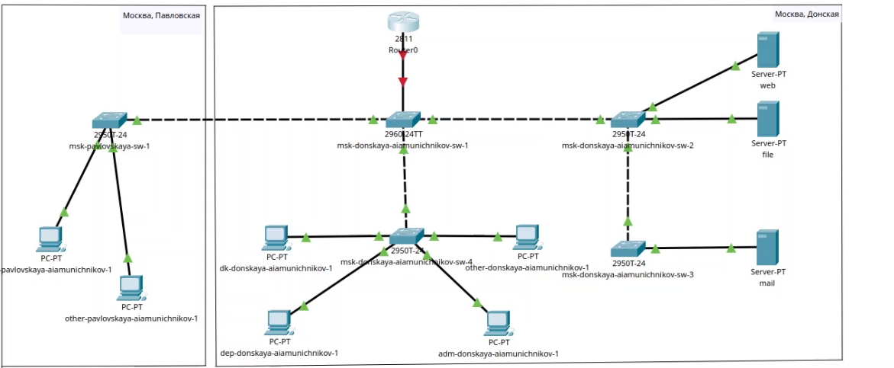

---
## Front matter
lang: ru-RU
title: Презентация по лабораторной работе №6
subtitle: ""
author:
  - Амуничников Антон
institute:
  - Российский университет дружбы народов, Москва, Россия

## i18n babel
babel-lang: russian
babel-otherlangs: english

## Formatting pdf
toc: false
toc-title: Содержание
slide_level: 2
aspectratio: 169
section-titles: true
theme: metropolis
header-includes:
 - \metroset{progressbar=frametitle,sectionpage=progressbar,numbering=fraction}
 - '\makeatletter'
 - '\makeatother'
---

## Докладчик

  * Амуничников Антон Игоревич
  * 1132227133
  * уч. группа: НПИбд-01-22
  * Факультет физико-математических и естественных наук
  * Российский университет дружбы народов

## Выполнение лабораторной работы

## В логической области проекта разместим маршрутизатор Cisco 2811.

{#fig:001 width=70%}

## Конфигурация маршрутизатора.

{#fig:002 width=70%}

## Настройка порта 24 коммутатора.

{#fig:003 width=70%}

## Настройка виртуальных интерфейсов.

{#fig:004 width=70%}

## 

{#fig:005 width=70%}

## Проверка доступности оконечных устройств из разных VLAN.

{#fig:009 width=70%}

## Пингование устройства другой сети.

{#fig:010 width=70%}

## Изучение процесса передвижения пакета ICMP по сети. 

{#fig:006 width=70%}

## Теперь попробуем передать пакет между устройствами разных сетей.

{#fig:007 width=70%}

## Посмотр содержимого пакета.

{#fig:008 width=70%}

# Выводы

В резултате выполнения лабораторной работы мы настроили статистическую маршрутизацию VLAN в сети.

